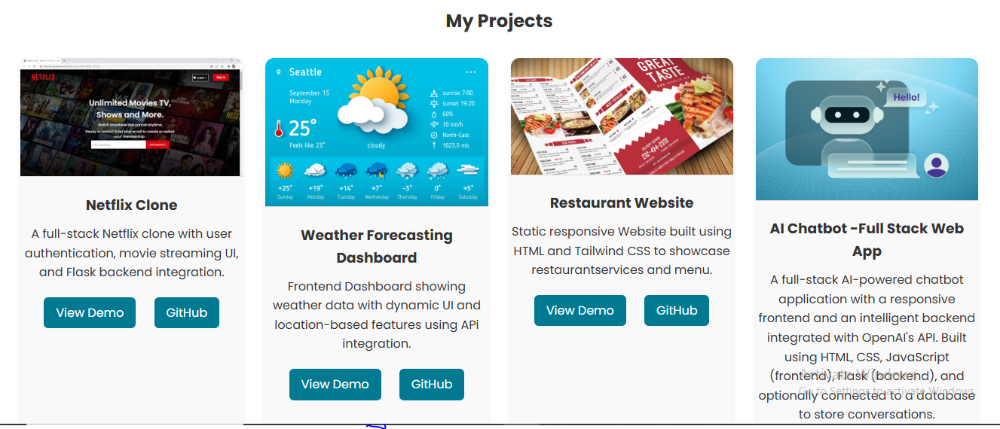
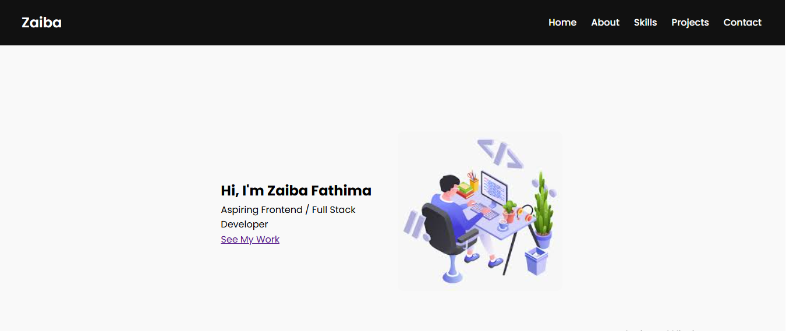

# Zaiba Fathima - Portfolio 💼

Welcome to my personal portfolio website! I'm Zaiba Fathima, a final-year Engineering student passionate about building responsive and clean web applications using HTML, CSS, JavaScript, and Python.


---

## 🌟 About Me

- 🎓 Final-year Engineering student  
- 💻 Aspiring Frontend / Full Stack Developer  
- 🌐 I enjoy crafting clean, user-friendly websites  
- 🛠️ Technologies: HTML, CSS, JavaScript, Python, Flask

---

## 🚀 Projects

### 📺 Netflix Clone  
A frontend replica of the Netflix homepage built with pure HTML and CSS.  


### 📝 Weather Forecasting Dashboard 
Frontend Dashboard showing weather data with dynamic UI and location-based features using APi integration. 


### 🍽️ Restaurant Website
Static responsive Website built using HTML and Tailwind CSS to showcase restaurantservices and menu.


### 🤖 AI Chatbot
A full-stack AI-powered chatbot application with a responsive frontend and an intelligent backend integrated with OpenAI's API.


---

## 🛠️ Skills

- HTML
- CSS
- JavaScript
- Python
- Flask
- Git and Github

---

## 📬 Contact Me

- 📧 Email: zebafatima2105@gmail.com  
- 📱 Phone: 7019008840  
- 🔗 [GitHub](https://github.com/zaiba2fathima)  
- 🔗 [LinkedIn](#) *(https://www.linkedin.com/in/zaiba-fathima-72b8082ab)

---

## 📌 How to Run Locally

1. Clone the repository  
   ```bash
   git clone https://github.com/zaiba2fathima/portfolio.git

---

## 📸 Project Screenshots

### 💻 Desktop View


### 📱 Mobile View


## 📸 Project Preview



---

## 🛠️ Technologies Used
- HTML
- CSS

---
 ## 🖼️ Developed & Designed By
Zaiba Fathima
With ❤️ and lots of HTML & CSS